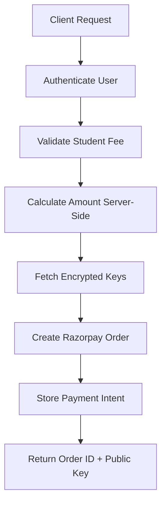
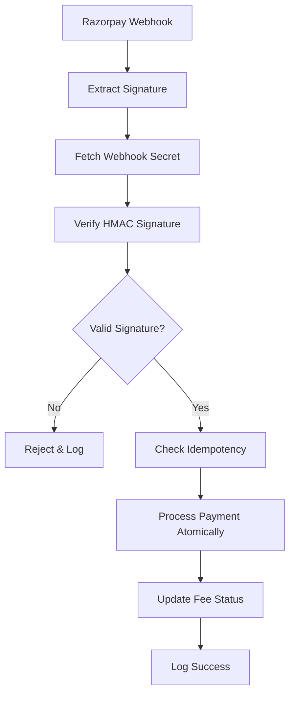

# 🔐 Secure Razorpay Integration Guide for FeeClub

This guide explains how to integrate the Razorpay payment gateway into the FeeClub application with enterprise-grade security.

---

## 🛡️ Security Architecture

### Backend Security (Supabase Edge Functions)
- **🔑 Encrypted Key Storage**: All API keys stored encrypted using Supabase Vault
- **🔐 Webhook Signature Verification**: HMAC-SHA256 verification for all webhooks
- **⚡ Atomic Transactions**: Database consistency with row-level locking
- **🎯 Idempotency**: Prevents duplicate payment processing
- **📊 Audit Logging**: Complete webhook and payment audit trail

### Frontend Security (Client-Side)
- **🚫 No Sensitive Data**: Never handles API secrets or webhook endpoints
- **✅ Amount Validation**: Server calculates and validates all amounts
- **🔍 Payment Tracking**: Uses secure order IDs for verification
- **⏰ Session Management**: Secure JWT-based authentication

---

## 📋 Prerequisites

### 1. Razorpay Dashboard Setup
1. **Create Razorpay Account**: [https://dashboard.razorpay.com/](https://dashboard.razorpay.com/)
2. **Get API Keys**: Note down `Key ID` and `Key Secret`
3. **Generate Webhook Secret**: Create a webhook endpoint secret
4. **Configure Webhook URL**: Set to `https://your-project.supabase.co/functions/v1/razorpay-verify`

### 2. Database Configuration
```sql
-- Add your school's Razorpay configuration
INSERT INTO school_configurations (school_id, config_key, config_value) VALUES
('your-school-id', 'razorpay_key_id', 'rzp_live_your_key_id'),
('your-school-id', 'razorpay_key_secret', encrypt_config_value('your_key_secret')),
('your-school-id', 'razorpay_webhook_secret', encrypt_config_value('whsec_your_webhook_secret'));
```

---

## 🔧 Backend Implementation

The backend Edge Functions are already implemented with enterprise security. Here's how they work:

### 1. Payment Initiation (`razorpay-initiate`)

**Security Features:**
- Validates user authentication and school association
- Server-side amount calculation (prevents client manipulation)
- Encrypted API key retrieval from database
- Secure order creation with tracking receipt

**Flow:**


### 2. Payment Verification (`razorpay-verify`)

**Security Features:**
- HMAC-SHA256 webhook signature verification
- Idempotency checks for duplicate webhooks
- Atomic database transactions with row locking
- Complete audit logging for compliance

**Flow:**


---

## 💻 Frontend Implementation

### 1. Install Razorpay SDK

```bash
npm install razorpay
# or
yarn add razorpay
```

### 2. Create Payment Hook

```typescript
// hooks/useRazorpayPayment.ts
import { useState } from 'react'

interface PaymentData {
  studentFeeId: string
  amount?: number
  notes?: Record<string, string>
}

interface RazorpayOptions {
  key: string
  amount: number
  currency: string
  name: string
  description: string
  order_id: string
  handler: (response: any) => void
  prefill: {
    name: string
    email?: string
    contact?: string
  }
  notes: Record<string, string>
  theme: {
    color: string
  }
}

export const useRazorpayPayment = () => {
  const [isLoading, setIsLoading] = useState(false)
  const [error, setError] = useState<string | null>(null)

  const initiatePayment = async (paymentData: PaymentData) => {
    setIsLoading(true)
    setError(null)

    try {
      // Step 1: Get authentication token
      const token = localStorage.getItem('authToken') // or from your auth context
      if (!token) {
        throw new Error('Authentication required')
      }

      // Step 2: Call backend to create payment order
      const response = await fetch('/functions/v1/razorpay-initiate', {
        method: 'POST',
        headers: {
          'Content-Type': 'application/json',
          'Authorization': `Bearer ${token}`
        },
        body: JSON.stringify(paymentData)
      })

      const orderData = await response.json()
      
      if (!orderData.success) {
        throw new Error(orderData.error || 'Failed to create payment order')
      }

      // Step 3: Open Razorpay Checkout
      return new Promise((resolve, reject) => {
        const options: RazorpayOptions = {
          key: orderData.razorpayKeyId, // Public key from server
          amount: Math.round(orderData.amount * 100), // Convert to paise
          currency: orderData.currency,
          name: orderData.schoolInfo.schoolName,
          description: orderData.feeDetails.structureName,
          order_id: orderData.razorpayOrderId,
          handler: (response) => {
            // ✅ Payment successful callback
            console.log('Payment successful:', response)
            
            // 🎯 IMPORTANT: This is for UX only
            // Actual verification happens via webhook
            resolve({
              success: true,
              paymentId: response.razorpay_payment_id,
              orderId: response.razorpay_order_id,
              signature: response.razorpay_signature
            })
          },
          prefill: {
            name: orderData.studentInfo.fullName,
            email: `${orderData.studentInfo.admissionNumber}@${orderData.schoolInfo.schoolName.toLowerCase().replace(/\s+/g, '')}.edu`
          },
          notes: orderData.notes || {},
          theme: {
            color: '#3B82F6' // Your brand color
          },
          modal: {
            ondismiss: () => {
              reject(new Error('Payment cancelled by user'))
            }
          }
        }

        // Load Razorpay script and open checkout
        const script = document.createElement('script')
        script.src = 'https://checkout.razorpay.com/v1/checkout.js'
        script.onload = () => {
          const rzp = new (window as any).Razorpay(options)
          rzp.open()
        }
        script.onerror = () => {
          reject(new Error('Failed to load Razorpay SDK'))
        }
        document.body.appendChild(script)
      })

    } catch (err) {
      const errorMessage = err instanceof Error ? err.message : 'Payment initiation failed'
      setError(errorMessage)
      throw err
    } finally {
      setIsLoading(false)
    }
  }

  return {
    initiatePayment,
    isLoading,
    error
  }
}
```

### 3. Payment Component

```typescript
// components/PaymentButton.tsx
import React from 'react'
import { useRazorpayPayment } from '../hooks/useRazorpayPayment'
import { toast } from 'sonner' // or your notification library

interface PaymentButtonProps {
  studentFeeId: string
  amount: number
  studentName: string
  feeName: string
  onPaymentSuccess?: () => void
}

export const PaymentButton: React.FC<PaymentButtonProps> = ({
  studentFeeId,
  amount,
  studentName,
  feeName,
  onPaymentSuccess
}) => {
  const { initiatePayment, isLoading, error } = useRazorpayPayment()

  const handlePayment = async () => {
    try {
      toast.info('Initiating payment...', { 
        description: 'Please wait while we prepare your payment' 
      })

      const result = await initiatePayment({
        studentFeeId,
        amount,
        notes: {
          student_name: studentName,
          fee_description: feeName
        }
      })

      // 🎉 Payment initiated successfully
      toast.success('Payment Successful!', {
        description: 'We are verifying your payment. You will receive a confirmation shortly.',
        duration: 5000
      })

      // Call success callback
      onPaymentSuccess?.()

      // 🔄 Optional: Poll for payment confirmation
      // In a real app, you might want to poll the backend
      // or use websockets to get real-time payment status
      setTimeout(() => {
        window.location.reload() // Refresh to show updated payment status
      }, 3000)

    } catch (err) {
      console.error('Payment error:', err)
      
      const errorMessage = err instanceof Error ? err.message : 'Payment failed'
      toast.error('Payment Failed', {
        description: errorMessage
      })
    }
  }

  return (
    <div className="payment-button-container">
      <button
        onClick={handlePayment}
        disabled={isLoading}
        className="payment-button"
      >
        {isLoading ? (
          <div className="flex items-center space-x-2">
            <div className="animate-spin rounded-full h-4 w-4 border-b-2 border-white"></div>
            <span>Processing...</span>
          </div>
        ) : (
          <div className="flex items-center space-x-2">
            <span>Pay ₹{amount.toLocaleString('en-IN')}</span>
            <svg className="w-4 h-4" fill="currentColor" viewBox="0 0 20 20">
              <path fillRule="evenodd" d="M10.293 3.293a1 1 0 011.414 0l6 6a1 1 0 010 1.414l-6 6a1 1 0 01-1.414-1.414L14.586 11H3a1 1 0 110-2h11.586l-4.293-4.293a1 1 0 010-1.414z" clipRule="evenodd" />
            </svg>
          </div>
        )}
      </button>
      
      {error && (
        <div className="error-message mt-2 text-red-600 text-sm">
          {error}
        </div>
      )}
    </div>
  )
}
```

### 4. Fee Management Dashboard

```typescript
// components/FeesDashboard.tsx
import React from 'react'
import { PaymentButton } from './PaymentButton'

interface StudentFee {
  id: string
  structureName: string
  totalDue: number
  amountPaid: number
  status: 'unpaid' | 'partially_paid' | 'paid'
  dueDate: string
}

interface FeesDashboardProps {
  studentFees: StudentFee[]
  studentName: string
  onPaymentSuccess: () => void
}

export const FeesDashboard: React.FC<FeesDashboardProps> = ({
  studentFees,
  studentName,
  onPaymentSuccess
}) => {
  return (
    <div className="fees-dashboard">
      <h2 className="text-2xl font-bold mb-6">Fee Payment Dashboard</h2>
      
      <div className="grid gap-6">
        {studentFees.map((fee) => {
          const balanceDue = fee.totalDue - fee.amountPaid
          
          return (
            <div key={fee.id} className="fee-card border rounded-lg p-6 shadow-sm">
              <div className="flex justify-between items-start mb-4">
                <div>
                  <h3 className="text-lg font-semibold">{fee.structureName}</h3>
                  <p className="text-gray-600">Due: {new Date(fee.dueDate).toLocaleDateString()}</p>
                </div>
                <div className={`px-3 py-1 rounded-full text-sm font-medium ${
                  fee.status === 'paid' ? 'bg-green-100 text-green-800' :
                  fee.status === 'partially_paid' ? 'bg-yellow-100 text-yellow-800' :
                  'bg-red-100 text-red-800'
                }`}>
                  {fee.status.replace('_', ' ').toUpperCase()}
                </div>
              </div>
              
              <div className="grid grid-cols-3 gap-4 mb-4">
                <div>
                  <p className="text-sm text-gray-600">Total Due</p>
                  <p className="text-lg font-semibold">₹{fee.totalDue.toLocaleString('en-IN')}</p>
                </div>
                <div>
                  <p className="text-sm text-gray-600">Paid</p>
                  <p className="text-lg font-semibold text-green-600">₹{fee.amountPaid.toLocaleString('en-IN')}</p>
                </div>
                <div>
                  <p className="text-sm text-gray-600">Balance</p>
                  <p className="text-lg font-semibold text-red-600">₹{balanceDue.toLocaleString('en-IN')}</p>
                </div>
              </div>
              
              {balanceDue > 0 && (
                <PaymentButton
                  studentFeeId={fee.id}
                  amount={balanceDue}
                  studentName={studentName}
                  feeName={fee.structureName}
                  onPaymentSuccess={onPaymentSuccess}
                />
              )}
              
              {fee.status === 'paid' && (
                <div className="text-center py-4 text-green-600 font-medium">
                  ✅ Fully Paid
                </div>
              )}
            </div>
          )
        })}
      </div>
    </div>
  )
}
```

---

## 🔍 Testing & Debugging

### 1. Test Mode Setup
```javascript
// Use Razorpay test keys for development
const TEST_KEY_ID = 'rzp_test_your_test_key'
const TEST_KEY_SECRET = 'your_test_secret'
const TEST_WEBHOOK_SECRET = 'whsec_test_webhook_secret'
```

### 2. Test Payment Flow
1. **Create Test Payment**: Use test card `4111 1111 1111 1111`
2. **Verify Webhook**: Check webhook logs in database
3. **Confirm Payment**: Verify payment status updated correctly

### 3. Monitor Webhook Logs
```sql
-- Check recent webhook activity
SELECT 
  webhook_event,
  signature_valid,
  processing_status,
  error_message,
  created_at
FROM webhook_logs 
WHERE school_id = 'your-school-id'
ORDER BY created_at DESC
LIMIT 10;
```

---

## 🚨 Error Handling

### Common Issues & Solutions

1. **Invalid Signature Error**
   - Verify webhook secret is correctly stored
   - Check signature calculation logic
   - Ensure raw payload is used for verification

2. **Duplicate Payment Error**
   - Check idempotency logic
   - Verify payment_id uniqueness
   - Review webhook retry mechanisms

3. **Amount Mismatch**
   - Always calculate amounts server-side
   - Convert between rupees and paise correctly
   - Validate against actual fee records

---

## 📊 Payment Analytics

Query payment analytics using the built-in view:

```sql
-- Get payment collection summary
SELECT 
  class,
  total_fees_assigned,
  fees_paid,
  fees_partial,
  fees_unpaid,
  total_amount_due,
  total_amount_collected,
  total_outstanding,
  (total_amount_collected::float / total_amount_due * 100)::decimal(5,2) as collection_percentage
FROM payment_analytics
WHERE school_id = 'your-school-id'
ORDER BY class;
```

---

## 🔒 Security Checklist

- [ ] ✅ API keys stored encrypted in database
- [ ] ✅ Webhook signature verification implemented
- [ ] ✅ Idempotency checks for duplicate payments
- [ ] ✅ Server-side amount validation
- [ ] ✅ Atomic database transactions
- [ ] ✅ Complete audit logging
- [ ] ✅ Authentication required for all operations
- [ ] ✅ Row-level security policies active
- [ ] ✅ CORS properly configured
- [ ] ✅ Error handling with secure responses

---

## 🚀 Production Deployment

### 1. Switch to Live Keys
```sql
-- Update to live Razorpay keys
UPDATE school_configurations 
SET config_value = encrypt_config_value('rzp_live_your_live_key')
WHERE config_key = 'razorpay_key_id';

UPDATE school_configurations 
SET config_value = encrypt_config_value('your_live_secret')
WHERE config_key = 'razorpay_key_secret';
```

### 2. Configure Production Webhook
- Set webhook URL to production Edge Function
- Use strong webhook secret
- Enable relevant events: `payment.captured`, `payment.failed`

### 3. Monitor & Maintain
- Set up alerts for failed payments
- Monitor webhook success rates
- Regular backup of payment data
- Compliance reporting as required

---

**🎉 Secure Razorpay Integration Complete!**

Your FeeClub application now has enterprise-grade payment processing with complete security, audit trails, and reliable webhook handling.